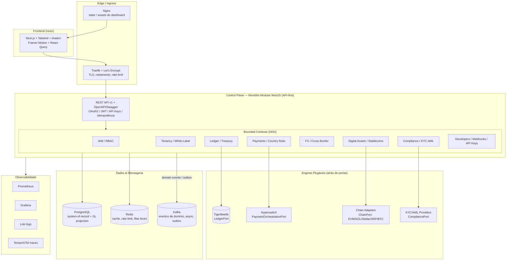
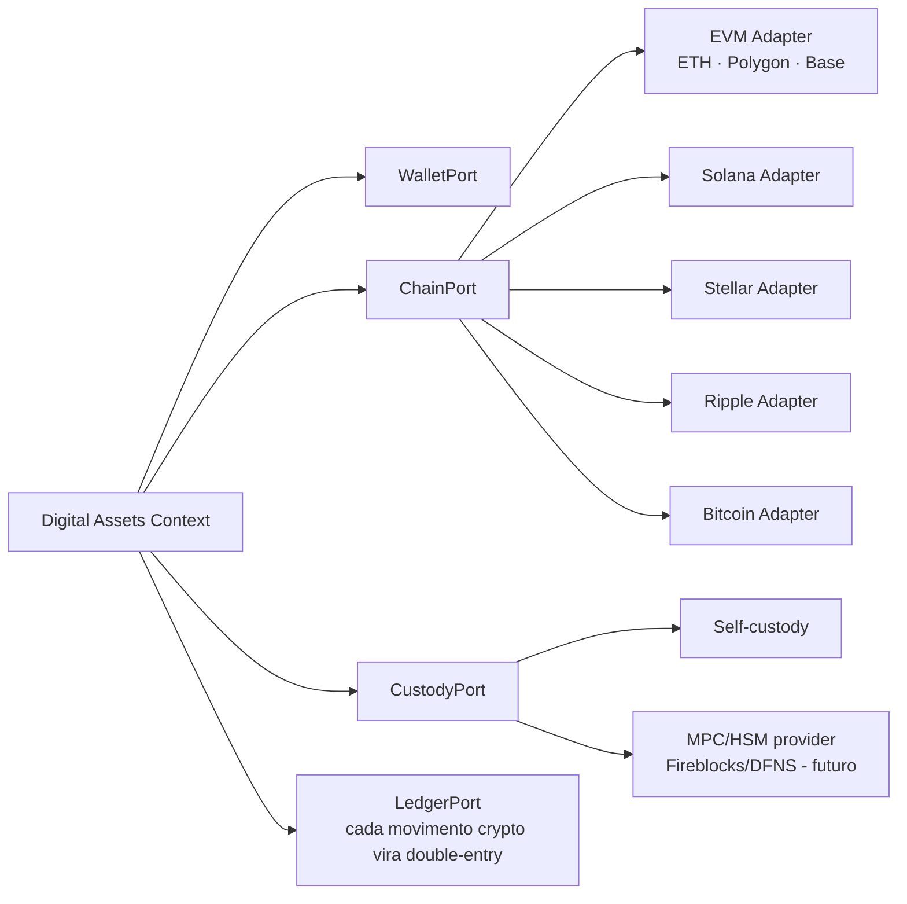
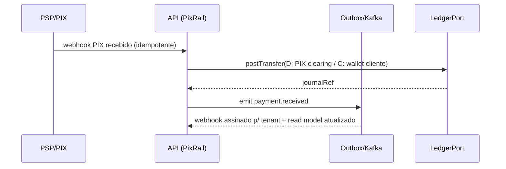
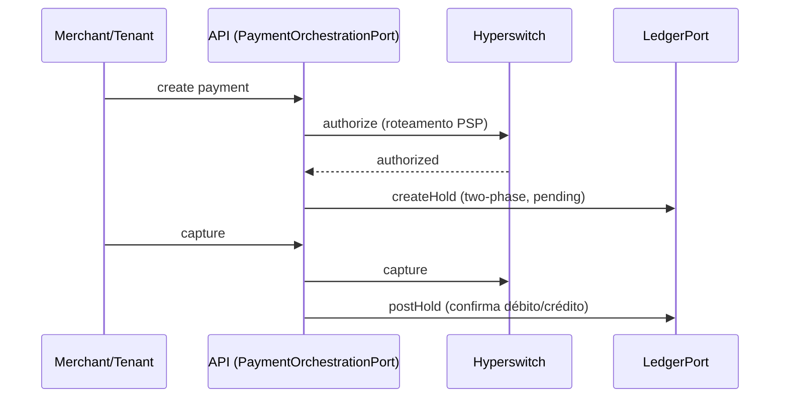
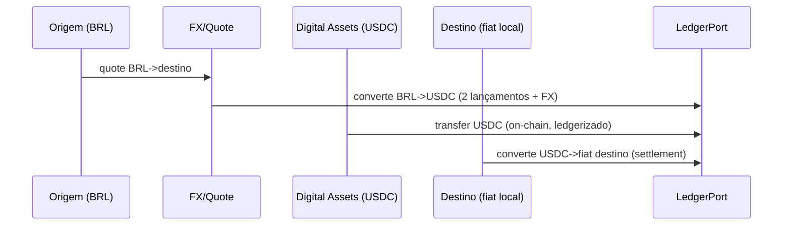

# ARCHITECTURE.md — Bass Financial Core

> Plataforma global de infraestrutura financeira (BaaS / Embedded Finance / Cross-Border)
> focada em América Latina, stablecoins e pagamentos internacionais.
>
> **Documento vivo.** Escrito **antes** de qualquer nova alteração de código, conforme
> exigência do projeto. Descreve o estado atual, a arquitetura-alvo, as justificativas
> tecnológicas, os fluxos financeiros e o roadmap de implementação por fases.

**Status:** Fase 0 — Arquitetura aprovada / baseline existente em produção-piloto
**Data:** 2026-07-26
**Branch:** `claude/global-financial-platform-kz6gnp`
**Modelo mental:** *Não reconstruir o que já existe. Compor open source maduro atrás de portas (hexagonal/DDD). Evoluir em etapas, cada uma funcionando por completo antes da próxima.*

---

## 0. Sumário Executivo (decisão em uma página)

O objetivo é uma infraestrutura equivalente a Stripe / Airwallex / Adyen / Rapyd / Wise
Platform, mas com foco em LatAm + stablecoins + cross-border + white-label + BaaS.

Nenhum projeto isolado resolve tudo. A decisão é **compor**, não escolher um só:

| Camada | Projeto escolhido | Papel | Por quê |
|---|---|---|---|
| **Control plane / API / domínio** | **Monólito modular NestJS (base já existente)** | Orquestração, multi-tenant, compliance, módulos de país, API-first | Já implementado, testado e em homologação. DDD + event-driven. Evoluir > recriar. |
| **Ledger / motor de saldos** | **TigerBeetle** (alvo) + Postgres journal (atual) | Double-entry de alta performance no hot-path do dinheiro | Banco de dados contábil determinístico, financial-grade, feito para exatamente isto. |
| **Orquestração de pagamentos / cartão / conectores PSP** | **Hyperswitch** | Roteamento, retries, vault PCI, abstração de conectores | Evita reimplementar 50+ integrações de PSP. Camada "switch" Stripe-like pronta. |
| **Interoperabilidade / settlement cross-scheme** | **Mojaloop** (referência/adapter futuro) | Switching entre DFSPs, settlement, FSPIOP | Padrão usado por switches nacionais. Adotamos padrões agora, componentes quando houver escala. |
| **Core banking (crédito/depósito) futuro** | **Apache Fineract** (referência/adapter futuro) | Empréstimos, poupança, GL bancário | Domínio bancário maduro. Integrar via adapter quando entrarmos em lending. |
| **Ledger multi-ativo (alternativa/benchmark)** | **Midaz** (referência) | Ledger developer-first multi-asset | Validação conceitual do nosso `LedgerPort`; mantido como opção de engine plugável. |

**Princípio unificador:** tudo acima fica atrás de **portas (interfaces)** no nosso monólito
modular. O motor de ledger, o orquestrador de pagamento e cada rail de país são
**implementações plugáveis**. Isso nos deixa começar com o que já existe (Postgres ledger,
PIX próprio) e trocar por engines best-of-breed (TigerBeetle, Hyperswitch) sem reescrever o domínio.

---

## 1. Estado Atual do Código (baseline real — não presumido)

O repositório **já contém** uma plataforma funcional. Auditá-la é pré-requisito para evoluí-la.

```
corebanking/ (monorepo pnpm + turbo)
├── apps/
│   ├── api/            NestJS 10 + Prisma + PostgreSQL
│   │   └── src/modules/
│   │       ├── iam/            Auth (JWT RS256), MFA/TOTP, RBAC, sessions, audit
│   │       ├── organizations/  Multi-tenant (BASS / WHITE_LABEL / COMPANY / MERCHANT)
│   │       ├── accounts/        Contas + saldos
│   │       ├── ledger/          Double-entry (journal entries, invariante Σdébito=Σcrédito, idempotência)
│   │       ├── pix/             Chaves PIX, transferências, QR (estático/dinâmico)
│   │       └── dashboard/       Agregações para o front
│   └── web/            Next.js 14 (App Router) + Tailwind + Recharts — dashboard dark
├── packages/shared/    Tipos/contratos compartilhados
├── docker-compose.yml       Dev: postgres, redis, adminer
├── docker-compose.prod.yml  Prod: api (multi-stage), postgres, redis (healthchecks)
├── .github/workflows/       ci.yml, deploy.yml
└── docs/AUDITORIA-HOMOLOGACAO.md
```

### O que já está pronto e **não será recriado**
- **Ledger double-entry** com invariante `Σ DEBIT == Σ CREDIT` validada em transação, idempotência por `idempotencyKey`, void protegido contra double-void, saldo por conta contábil (`ledger.service.ts`).
- **RBAC** com escopos `GLOBAL / ORGANIZATION / WHITE_LABEL / MERCHANT`, guards encadeados (Throttler → JWT → Roles → Permissions), Argon2id, refresh token atômico.
- **Multi-tenant** via `Organization` + `OrganizationType` — base do white-label.
- **PIX** (chaves, transferências, QR) — primeiro rail de país (Brasil).
- **Dashboard** Next.js dark com 9+ páginas, componentes reutilizáveis (MetricCard, charts).
- **Infra**: Docker multi-stage, healthchecks, CI/CD, migrations versionadas.

### Dívidas conhecidas (da auditoria) a endereçar no roadmap
- Next.js 14 → 15 (vulnerabilidades HIGH mitigadas mas não corrigidas).
- JWT auto-gen deve ser eliminado em produção (chaves geridas por secret manager).
- `localStorage` para JWT → migrar para cookie `httpOnly` + CSRF.
- Front atual será **substituído** pelo novo dashboard (requisito da Fase 3).

---

## 2. Fase 1 — Análise dos Projetos e Justificativa

### 2.1 Hyperswitch (Rust — Juspay)
**O que é:** orquestrador/switch de pagamentos open source. Roteamento inteligente entre
50+ PSPs, retries, fallback, vault PCI-DSS, API unificada de pagamentos.
**Força:** abstração de conectores e roteamento — o núcleo "Stripe-like" de aquisição de cartão.
**Fraqueza:** stack Rust separada; foco em cartão/PSP, não em ledger nem BaaS multi-país.
**Decisão:** ✅ **Adotar como camada de orquestração de pagamentos** (cartão + roteamento PSP),
atrás do `PaymentOrchestrationPort`. Evita reconstruir dezenas de integrações. Deploy como
serviço próprio, consumido pelo monólito via API.

### 2.2 TigerBeetle (Zig)
**O que é:** banco de dados de contabilidade double-entry, determinístico, de altíssima vazão
(milhões de transfers/s), com primitivas nativas de contas, transfers e transfers em duas fases.
**Força:** é literalmente um motor de ledger financial-grade — correção + performance no hot-path.
**Fraqueza:** só ledger (sem metadados de negócio); requer modelagem de contas em inteiros.
**Decisão:** ✅ **Adotar como motor de saldos autoritativo (alvo)**. O Postgres journal atual
vira a **projeção contábil/GL** e system-of-record de metadados; o TigerBeetle assume o
hot-path de saldo/transfer. Introduzido atrás do `LedgerPort` já existente, sem reescrever o domínio.

### 2.3 Apache Fineract (Java/Spring)
**O que é:** plataforma de core banking completa — clientes, poupança, empréstimos, GL, KYC.
**Força:** domínio bancário maduro (portfólio de crédito/depósito, contabilidade).
**Fraqueza:** pesado, monolítico, Java, modelo de dados complexo; difícil de embutir num BaaS
API-first moderno; não foi feito para stablecoins/cross-border.
**Decisão:** 🔵 **Referência de domínio + adapter futuro**. Quando entrarmos em lending/depósitos
regulados, integramos via `CoreBankingPort` em vez de reimplementar produtos de crédito. Não é a base.

### 2.4 Mojaloop (Java/Node)
**O que é:** camada de interoperabilidade para pagamentos inclusivos — switching em tempo real
entre DFSPs, settlement, padrão FSPIOP; base de switches nacionais.
**Força:** interoperabilidade inter-instituições e settlement — exatamente o problema cross-border.
**Fraqueza:** microserviços pesados; overkill antes de haver múltiplos participantes/scheme.
**Decisão:** 🔵 **Referência de arquitetura para cross-border/settlement + adapter futuro**.
Adotamos padrões (FSPIOP, settlement windows) agora no módulo FX/cross-border; deployamos
componentes Mojaloop quando atingirmos escala de interoperabilidade multi-DFSP.

### 2.5 Midaz (Go — Lerian)
**O que é:** ledger core open source, cloud-native, developer-first: multi-ativo, multi-moeda,
double-entry imutável, DDD, CQRS, event-driven, arquitetura de plugins.
**Força:** conceitualmente o mais próximo do nosso alvo (BaaS LatAm, multi-ativo, API-first).
**Fraqueza:** mais novo/menos comprovado em escala que TigerBeetle; outra stack (Go).
**Decisão:** 🔵 **Benchmark do `LedgerPort` e engine plugável alternativo**. Se o TigerBeetle
se mostrar restritivo para multi-ativo/crypto, Midaz é o plano B — por isso o ledger fica atrás de porta.

### 2.6 Conclusão da escolha
> **Composição, não escolha única.** Monólito modular NestJS (base existente) como control
> plane; **TigerBeetle** como motor de ledger; **Hyperswitch** como orquestração de pagamento;
> **Mojaloop** e **Fineract** como referências e adapters futuros; **Midaz** como engine de
> ledger alternativo plugável. Tudo desacoplado por portas para não reconstruir nada e permitir troca.

---

## 3. Arquitetura-Alvo (visão macro)



### 3.1 Princípios arquiteturais
- **Modular Monolith first.** Um deployable NestJS com bounded contexts isolados por módulo e
  fronteiras explícitas. Microserviços **só** quando um contexto exigir escala/isolamento
  independentes (candidatos naturais: Hyperswitch, TigerBeetle, chain adapters — já externos).
- **DDD.** Cada módulo = bounded context com linguagem ubíqua, agregados e application services.
- **Event-Driven.** Eventos de domínio publicados via **outbox transacional** → Kafka. Nada de
  efeito colateral fora da transação de escrita.
- **CQRS onde faz sentido.** Escrita passa pelo ledger/agregados; leitura de dashboards/relatórios
  usa projeções materializadas (read models), não o caminho de escrita.
- **API-First.** Todo recurso nasce como API REST versionada + contrato OpenAPI antes da UI.
- **Ports & Adapters (Hexagonal).** Engines externos (ledger, pagamento, chain, KYC) atrás de
  interfaces; o domínio não conhece o fornecedor.
- **Multi-tenant por design.** `orgId`/`tenantId` propagado e isolado em toda leitura/escrita.

---

## 4. Bounded Contexts / Módulos

| Contexto | Módulos de produto | Estado |
|---|---|---|
| **IAM & Segurança** | Auth, MFA, RBAC, Sessions, Audit, API Keys, OAuth | ✅ base pronta |
| **Tenancy / White-Label** | Organizations, Branding, Domínios, Produtos habilitados, Tarifas | 🟡 base (Organization) → expandir |
| **Ledger & Treasury** | Chart of accounts, Journal, Balances, Reconciliation | ✅ Postgres → alvo TigerBeetle |
| **Accounts & Wallets** | Contas, Wallets, Saldos, Holds/two-phase | 🟡 accounts pronto → wallets |
| **Payments** | PIX, TED, Boleto, Cartão, Wire, SWIFT (por país) | 🟡 PIX pronto → demais rails |
| **FX & Cross-Border** | Cotação, Conversão, Settlement, Quotes | ⬜ a implementar |
| **Digital Assets** | USDT, USDC, BTC, ETH, SOL, Polygon, Base, Stellar, XRP | ⬜ arquitetura/ports |
| **Compliance** | KYC, KYB, AML, PEP, Sanções, Travel Rule, Risk | ⬜ estrutura |
| **Developers** | Webhooks, API Keys, Logs, Sandbox, Docs | 🟡 parcial |
| **Analytics** | Dashboard, Relatórios, Read models | 🟡 dashboard pronto |
| **Admin** | Administração global, feature flags, tarifação | ⬜ |

Legenda: ✅ pronto · 🟡 parcial · ⬜ a fazer.

---

## 5. Ledger — o coração (Modern-Treasury-like)

**Regra invariável:** *todo dinheiro passa pelo Ledger. Nenhuma transação altera saldo
diretamente.* Saldo é sempre derivado de lançamentos double-entry postados.

### 5.1 Modelo
- **Double-Entry.** Toda movimentação = ≥1 débito + ≥1 crédito com `Σ DEBIT == Σ CREDIT`
  (já implementado e testado).
- **Imutabilidade.** Journal entries nunca são editados; correções via estorno (void/reversal).
- **Idempotência.** `idempotencyKey` único por lançamento (já implementado).
- **Multi-moeda / multi-ativo.** `currency` por conta contábil; fiat e crypto no mesmo modelo
  contábil (asset code = BRL, USDC, BTC…), conversões sempre via par de lançamentos + linha de FX.
- **Two-phase transfers (holds).** Autorização (pending) → captura/void — necessário para cartão,
  PIX agendado, settlement cross-border. Alvo: primitiva nativa do TigerBeetle.

### 5.2 `LedgerPort` (abstração de engine)
```
LedgerPort
  createAccount(assetCode, type, tenantId): AccountRef
  postTransfer(entries[], idempotencyKey): JournalRef   // débito/crédito balanceados
  createHold(...) / postHold(...) / voidHold(...)        // two-phase
  getBalance(accountRef, at?): Balance
```
- **Adapter 1 (atual):** `PostgresLedgerAdapter` — a `ledger.service.ts` existente.
- **Adapter 2 (alvo):** `TigerBeetleLedgerAdapter` — hot-path de saldo/transfer.
- **Adapter 3 (opção):** `MidazLedgerAdapter`.
Postgres permanece como **GL projection** e system-of-record de metadados/reconciliação.

---

## 6. Multi-Tenant & White-Label

Cada tenant (WHITE_LABEL/COMPANY/MERCHANT sob a org raiz BASS) configura:

| Config | Onde |
|---|---|
| Logo, nome, cores/tema, domínio próprio | `TenantBranding` |
| Produtos habilitados (PIX, cartão, crypto, FX…) | `TenantProducts` (feature flags por tenant) |
| Tarifas / pricing por produto e moeda | `TenantPricing` |
| Moedas / países habilitados | `TenantMarkets` |
| Permissões / papéis | RBAC com escopo `WHITE_LABEL`/`MERCHANT` (já existe) |

- **Isolamento de dados:** `tenantId` obrigatório em toda query (row-level, reforçado por guard +
  Prisma middleware). Opção futura de schema-per-tenant para clientes enterprise.
- **Domínio custom:** Traefik roteia `*.cliente.com` → mesmo backend, tenant resolvido por host.
- **Branding no front:** dashboard novo lê o tema do tenant via API (white-label real, não template).

---

## 7. RBAC & Permissões

Baseado no IAM existente (escopos `GLOBAL/ORGANIZATION/WHITE_LABEL/MERCHANT`). Papéis-alvo:

`Admin Global · Compliance · Financeiro · Operações · Comercial · Cliente · Desenvolvedor · Auditor`

- Permissões granulares (`ledger:read`, `payment:create`, `compliance:approve`…) → papéis → usuários.
- Escopo do papel limita o alcance (global vs. um tenant específico).
- Guards já encadeados: **Throttler → JWT → Roles → Permissions**.
- **Auditor** = acesso somente-leitura + trilha de auditoria imutável (`AuditLog`).

---

## 8. Arquitetura Multi-País (adicionar país sem tocar no core)

Cada país é um **plugin** que registra rails, moedas e provedores. O core não muda ao adicionar país.

```
CountryModule (registry-driven)
  ├── currencies: [BRL] / [PYG] / [ARS, USD] ...
  ├── rails: implementam PaymentRailPort
  │     PixRail, TedRail, BoletoRail, SpeiRail, WireRail, LocalTransferRail...
  ├── kycProvider: implementa CompliancePort (regras locais)
  └── config: cutoffs, feriados, limites, formato de conta
```

`PaymentRailPort`:
```
PaymentRailPort
  initiate(payment): RailRef
  status(railRef): RailStatus
  handleWebhook(payload): DomainEvent   // async, idempotente
  reverse(railRef): RailRef
```

### Países (registro inicial)
| País | Moeda(s) | Rails iniciais | Estado |
|---|---|---|---|
| 🇧🇷 Brasil | BRL | PIX ✅, TED, Boleto, Cartão, Open Finance | PIX pronto |
| 🇵🇾 Paraguai | PYG | Transferência local, FX BRL↔PYG | arquitetura |
| 🇦🇷 Argentina | ARS, USD | Transferências | arquitetura |
| 🇺🇾 Uruguai | UYU, USD | Transferências | arquitetura |
| 🇨🇱 Chile | CLP | Transferências | arquitetura |
| 🇵🇪 Peru | PEN | Transferências | arquitetura |
| 🇲🇽 México | MXN | SPEI | arquitetura |

Adicionar país = novo módulo `countries/<iso>` + registro + config. Zero mudança no domínio central.

---

## 9. Digital Assets / Stablecoins (arquitetura desacoplada)

Não é "só integrar". É um bounded context com **portas por cadeia e por custódia**, para plugar
qualquer chain/stablecoin sem tocar no domínio.



- **Ativos-alvo:** USDT, USDC, BTC, ETH, SOL, Polygon, Base, Stellar, XRP.
- **Regra:** todo depósito/saque on-chain gera lançamento double-entry (asset code = símbolo do token).
- **Custódia plugável:** começa self-custody/testnet; MPC (Fireblocks/DFNS) via `CustodyPort` depois.
- **Travel Rule** integrado ao Compliance para transferências VASP-a-VASP.
- **Nada de integração real na fase de arquitetura** — apenas ports, modelos e contratos.

---

## 10. FX & Cross-Border

- **Quote engine:** cotação com spread por tenant, TTL, `quoteId` idempotente.
- **Conversão:** sempre 2 lançamentos + linha de FX no ledger (nunca mexe saldo direto).
- **Settlement:** janelas de settlement inspiradas em Mojaloop; netting entre corredores.
- **Corredores iniciais:** BRL↔PYG, BRL↔USD, USD↔ARS, cross via stablecoin (BRL→USDC→destino).
- **Cross-border via stablecoin:** rail alternativo — origem fiat → USDC → destino fiat, tudo ledgerizado.

---

## 11. Compliance (AML/KYC/KYB)

Estrutura como bounded context com `CompliancePort` (provedores plugáveis por país):

`KYC · KYB · AML · PEP · Sanções · Travel Rule · Monitoramento · Risk · Auditoria · LGPD · GDPR`

- **KYC/KYB:** onboarding com verificação de identidade/documento (provedor plugável).
- **Screening:** PEP + listas de sanções (OFAC/ONU/UE) na criação e periodicamente.
- **AML/monitoramento:** regras de transação (velocity, structuring, thresholds) + score de risco.
- **Travel Rule:** metadados de originador/beneficiário em transferências crypto/cross-border.
- **LGPD/GDPR:** minimização, retenção, direito ao esquecimento, DPA por tenant, logs de acesso a PII.
- **Auditoria:** `AuditLog` imutável append-only; papel **Auditor** com acesso somente-leitura.

---

## 12. APIs (API-First)

Todo recurso é API antes de UI.

| Requisito | Como |
|---|---|
| **REST** | Recursos versionados `/api/v1/...` |
| **Versionamento** | Prefixo de versão + deprecation policy; contratos em `packages/shared` |
| **OpenAPI/Swagger** | Gerado do NestJS (`@nestjs/swagger`); publicado no portal Developers |
| **Idempotência** | Header `Idempotency-Key` → dedupe (já no ledger; padronizar globalmente) |
| **Webhooks** | Entrega assinada (HMAC), retry com backoff, dead-letter, replays |
| **Async Events** | Kafka + outbox transacional; consumidores idempotentes |
| **Rate Limit** | Throttler (Redis) por API key/tenant (já ativo) |
| **AuthN/Z** | OAuth2 + JWT (RS256) para usuários; **API Keys** para servidores; RBAC para escopo |
| **Erros** | Envelope de erro consistente tipado por status (já existe no front `ApiError`) |

---

## 13. Fluxos Financeiros (exemplos)

### 13.1 PIX recebido (cash-in)


### 13.2 Cartão (autorização → captura) via Hyperswitch


### 13.3 Cross-border via stablecoin


---

## 14. Fase 2 — Deploy & Infraestrutura

Três ambientes: **Development · Staging · Production**.

| Recurso | Dev | Staging | Production |
|---|---|---|---|
| Orquestração | `docker-compose.yml` | `docker-compose.staging.yml` | `docker-compose.prod.yml` + Traefik |
| TLS | — | Let's Encrypt (staging CA) | Let's Encrypt (prod) via Traefik |
| Postgres | container | container/managed | managed + réplica + PITR |
| Redis | container | container | container/managed |
| Kafka | opcional | sim | sim (quando eventos async entram) |
| Ingress | localhost | Traefik | Traefik (TLS, rate-limit) + Nginx (assets) |
| Observabilidade | logs | Prometheus+Grafana+Loki | + Tempo/OTel, alertas |
| Backup | — | diário | contínuo (WAL) + snapshot diário + retenção |

- **HTTPS:** Traefik + Let's Encrypt (ACME), redirect 80→443, HSTS.
- **Health checks:** `/api/health` (já existe) + readiness/liveness por dependência.
- **Logs:** JSON estruturado → Loki; correlação por `requestId`/`tenantId`.
- **Monitoramento/Observabilidade:** Prometheus (métricas), Grafana (dashboards), OpenTelemetry (traces), alertas.
- **Backup:** dump lógico diário + WAL archiving (PITR) para o ledger; teste de restore periódico.
- **CI/CD:** GitHub Actions — `ci.yml` (lint/test/build) + `deploy.yml` (build imagem → push → deploy por ambiente); migrations aplicadas de forma controlada.
- **Segredos:** via secret manager / env de ambiente; **chaves JWT nunca auto-geradas em prod**.

---

## 15. Fase 3 — Frontend (dashboard novo, do zero)

Substitui o front atual. Sem cara de template.

- **Stack:** Next.js (App Router) · TailwindCSS · **shadcn/ui** · **Framer Motion** · **React Query** (TanStack).
- **Estética:** Dark mode, minimalista, premium, executivo, responsivo, muito rápido. Referências:
  Stripe · Mercury · Ramp · Airwallex · Brex · Linear · Vercel · Supabase.
- **White-label:** tema/branding carregado por tenant via API.
- **Módulos de UI:** Dashboard · Clientes · Organizações · Wallets · Contas · Saldo · Ledger ·
  Pagamentos (PIX/Cartão/TED/Wire/SWIFT) · Stablecoins · FX/Conversão · Compliance (KYC/AML/Risk) ·
  Webhooks · Logs · API Keys · Developers · White Labels · Relatórios · Administração.
- **Segurança front:** JWT em cookie `httpOnly` + CSRF (corrige dívida do `localStorage`).

---

## 16. Roadmap de Implementação (etapas — cada uma funciona antes da próxima)

> Regra de ouro: **nunca implementar tudo de uma vez.** Cada fase entrega valor funcionando.

| Fase | Escopo | Critério de "pronto" |
|---|---|---|
| **F0 — Arquitetura** *(este doc)* | ARCHITECTURE.md, decisões, ports | Documento aprovado ✅ |
| **F1 — Deploy do baseline** | Subir o que já existe em Docker (dev), healthchecks, seed, smoke test | `docker compose up` sobe API+DB+Redis, `/api/health` verde, login funciona |
| **F2 — Hardening & envs** | Traefik+LE, staging/prod compose, observabilidade, backup, CI/CD, segredos | 3 ambientes provisionáveis, HTTPS, métricas/logs, backup testado |
| **F3 — Frontend novo** | Dashboard Next+shadcn+Framer+React Query (dark, white-label) | Dashboard novo consome API real, substitui o antigo |
| **F4 — Contratos de porta** | Formalizar `LedgerPort`, `PaymentRailPort`, `CompliancePort`, `ChainPort` sobre o código atual | Ledger/PIX atuais reimplementados atrás das portas, testes verdes |
| **F5 — Ledger engine** | `TigerBeetleLedgerAdapter` no hot-path; Postgres como GL projection | Saldos servidos pelo TigerBeetle; reconciliação bate |
| **F6 — Multi-país** | Módulos de país (rails locais) + FX BRL↔PYG; SPEI (MX) | 2+ países novos operando via `PaymentRailPort` |
| **F7 — Digital Assets** | Ports + adapters testnet (EVM/USDC), ledgerização, Travel Rule | Depósito/saque testnet ledgerizado ponta a ponta |
| **F8 — Compliance & White-label** | KYC/AML/screening plugáveis; branding/pricing/produtos por tenant | Onboarding com KYC + tenant white-label completo |
| **F9 — Pagamentos avançados** | Hyperswitch (cartão), TED/Boleto, Wire/SWIFT, webhooks/idempotência globais | Cartão via Hyperswitch + rails BR completos |

---

## 17. Dependências, Riscos e Decisões em Aberto

**Dependências novas (por fase, não agora):** TigerBeetle, Hyperswitch, Kafka, Traefik, Prometheus/Grafana/Loki/OTel; shadcn/Framer/React Query no front.

**Riscos:**
- **Regulatório/licenciamento** por país (o maior risco — cada rail/moeda exige habilitação legal).
- **Custódia crypto** (chaves privadas) — mitigar com MPC/HSM antes de mainnet.
- **Consistência ledger↔engine externo** ao migrar para TigerBeetle — mitigar com reconciliação + dual-write controlado.
- **Next.js 14 vulns** — corrigir na F3 com o front novo (Next 15).

**Decisões em aberto (a resolver na fase correspondente):**
- TigerBeetle vs. Midaz como engine primário de ledger multi-ativo.
- Isolamento multi-tenant: row-level (padrão) vs. schema-per-tenant (enterprise).
- Custódia: self-custody vs. provedor MPC (Fireblocks/DFNS).

---

### Apêndice — Referências dos projetos
- Hyperswitch — orquestração de pagamentos (Juspay).
- TigerBeetle — banco de dados de contabilidade double-entry.
- Apache Fineract — plataforma de core banking.
- Mojaloop — interoperabilidade de pagamentos / settlement.
- Midaz (Lerian) — ledger core open source multi-ativo.

*Fim do ARCHITECTURE.md — documento vivo, atualizado a cada fase.*
