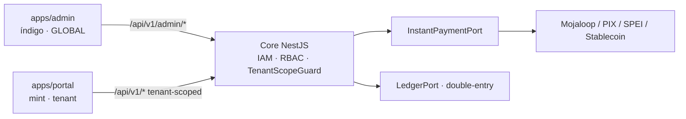

# ENVIRONMENTS — Ambientes Separados (Admin × Cliente)

> Organização de **dois ambientes distintos** dentro da estrutura atual do monorepo,
> sobre o mesmo core (monólito modular NestJS). Foco em **pagamento instantâneo**
> (PIX, SPEI, rails locais em tempo real, liquidação instantânea em stablecoin) —
> **sem cartão de crédito ou outros métodos**. Complementa [`ARCHITECTURE.md`](../ARCHITECTURE.md).

## 1. Os dois ambientes

| | 🟪 **Ambiente Administrativo** | 🟢 **Ambiente do Cliente** |
|---|---|---|
| Quem usa | Time interno da Bass | Tenant que é **cliente do gateway** (white-label / merchant) |
| Enxerga | **Todos os clientes** | **Só o próprio tenant** (isolado) |
| Escopo RBAC | `GLOBAL` | `WHITE_LABEL` / `MERCHANT` / `ORGANIZATION` |
| Superfície API | `/api/v1/admin/*` | `/api/v1/*` (tenant-scoped) |
| Frontend | `apps/admin` | `apps/portal` |
| Identidade visual | Índigo (control plane) | Mint (produto/dinheiro), com branding do tenant |
| Objetivo | Gerir clientes, gateway, liquidez, compliance global, tarifas | Receber/enviar instantâneo, saldos, extrato, API keys, KYC |

**Protótipos visuais (MVP):**
- Admin — Console Global: gestão de todos os clientes, gateway instantâneo (Mojaloop), liquidez multi-moeda.
- Cliente — Portal (Aurora Pay): cobrança PIX instantânea, saldos, extrato, developers — isolado por tenant.

Os ambientes são **separados de fato** (apps distintos + superfícies de API distintas), não apenas telas diferentes de um mesmo app.

## 2. Backend — uma API, duas superfícies separadas

O monólito modular permanece único (não viramos microserviços). A separação é por
**superfície de rota + guard de escopo**, reutilizando o IAM/RBAC já existente
(`RoleScope`, `OrganizationType`, guards `JWT → Roles → Permissions`).

```
apps/api/src/
├── admin/                     # superfície ADMIN (escopo GLOBAL)
│   ├── admin.module.ts        # agrupa controllers administrativos
│   └── */*.admin.controller.ts  (@AdminScope) — clientes, gateway, liquidez, compliance global, tarifas
├── modules/                   # domínio compartilhado (ledger, pix, iam, organizations, accounts…)
└── common/
    ├── decorators/scope.decorator.ts   # @AdminScope() / @TenantScope()
    └── guards/tenant-scope.guard.ts     # resolve e força o orgId do tenant
```

### Regras de isolamento
1. **Admin (`/api/v1/admin/*`)** exige papel de escopo `GLOBAL`; pode informar `orgId` de qualquer cliente.
2. **Cliente (`/api/v1/*`)** deriva o `orgId` **do próprio JWT** — nunca aceita `orgId` de outro tenant no corpo/query. O `TenantScopeGuard` injeta e força esse `orgId` em toda leitura/escrita (reforçado por middleware Prisma).
3. **Auditoria** (`AuditLog`) registra qual ambiente/ator originou cada ação.

Esboço das primitivas (a aplicar na fase de implementação, sem quebrar o baseline atual):

```ts
// common/decorators/scope.decorator.ts
export const ADMIN_SCOPE = 'admin_scope';
export const AdminScope = () => SetMetadata(ADMIN_SCOPE, true);   // exige RoleScope.GLOBAL

// common/guards/tenant-scope.guard.ts  (resumo)
@Injectable()
export class TenantScopeGuard implements CanActivate {
  canActivate(ctx: ExecutionContext) {
    const req = ctx.switchToHttp().getRequest();
    const isAdmin = this.reflector.get(ADMIN_SCOPE, ctx.getHandler());
    if (isAdmin) return req.user?.scopes?.includes('GLOBAL');   // superfície /admin
    // superfície tenant: força o orgId do token, ignora orgId externo
    req.tenantId = req.user.orgId;
    return true;
  }
}
```

## 3. Frontend — dois apps no monorepo

O `apps/web` atual é dividido em dois apps independentes (mesmo design system, temas distintos):

```
apps/
├── admin/     # Next.js — Console Global (índigo). Consome /api/v1/admin/*
└── portal/    # Next.js — Portal do Cliente (mint + branding do tenant). Consome /api/v1/*
```

- Cada app tem seu login e sua sessão; papéis `GLOBAL` só acessam o admin, papéis de tenant só o portal.
- O **portal** carrega logo/cores/domínio do tenant (white-label) via API — sem cara de template.
- Stack alvo (F3): Next.js + TailwindCSS + shadcn/ui + Framer Motion + React Query.

## 4. Gateway open source multi-moeda — instantâneo

Foco em **pagamento instantâneo**, portanto o gateway open source multi-moeda é
**Mojaloop** (switch de pagamento em tempo real / interoperabilidade FSPIOP), somado aos
rails instantâneos por país e à liquidação instantânea em stablecoin — **atrás de porta**:

```
InstantPaymentPort
  initiate(payment): RailRef            # PIX, SPEI, transferência instantânea local, USDC
  status(railRef): RailStatus
  handleWebhook(payload): DomainEvent   # idempotente
  quote(fromCcy,toCcy,amount): Quote    # FX/stablecoin instantâneo

Adapters: PixRail (BR) · SpeiRail (MX) · InstantLocalRail (PY/AR/UY/CL/PE) ·
          StablecoinRail (USDC/USDT) · MojaloopSwitch (interoperabilidade multi-DFSP)
```

> **Fora de escopo:** cartão de crédito e demais métodos não-instantâneos. Por isso
> **Hyperswitch não é adotado** — ele é orquestração de cartão/PSP. Toda movimentação
> continua passando pelo Ledger double-entry (regra invariável).

## 5. Fluxo (ambos os ambientes, mesmo core)



## 6. Estado da implementação

- [x] **Backend — separação de escopo (feito).** `common/decorators/scope.decorator.ts` (`@AdminScope`)
      + `common/guards/scope.guard.ts` (registrado como `APP_GUARD` após Permissions).
      O JWT passou a carregar `scopes` (derivado de `role.scope`); `AuthUser.scopes` e a
      `jwt.strategy` propagam o claim. Backward-compatible (tokens antigos sem `scopes` não
      sofrem isolamento). Cobertura: `scope.guard.spec.ts` (9 testes).
- [x] **Backend — superfície admin (feito).** `apps/api/src/admin/` com `AdminModule` e
      `AdminClientsController` em `/api/v1/admin/clients` (`@AdminScope`, reusa `OrganizationsService`).
      Verificado: admin GLOBAL lista todos os tenants (200); sem token 401; superfície tenant intacta.
- [x] **Frontend — split feito.** `apps/admin` (índigo, escopo GLOBAL, consome `/api/v1/admin/*`)
      e `apps/portal` (mint, tenant-scoped, consome `/api/v1/*`) — Next.js 14 + Tailwind +
      React Query + Framer Motion, dark, com login real e overview ligada à API. Ambos buildam
      (`next build`) e passam e2e de login no browser (10/10): portal carrega conta + ledger,
      admin lista todos os clientes. O `apps/web` legado permanece até ser aposentado.
- [ ] Introduzir `InstantPaymentPort` e mover o PIX atual para trás dele; adicionar SPEI e Mojaloop.
- [ ] Migrar controllers tenant para consumir `req.tenantId` (exposto pelo `ScopeGuard`) em vez de `orgId` de query.

*A implementação segue o roadmap por fases do ARCHITECTURE.md.*
